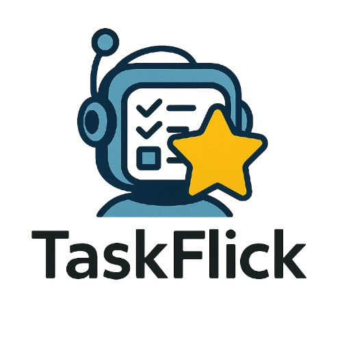

# TaskFlick - Transform Tasks into Epic Quests

<p align="center">
  
</p>

<p align="center">
  <b>Transform ordinary tasks into epic quests with AI-powered narratives!</b>
</p>

<p align="center">
  
  
  
  
</p>

## ✨ Features

- 🎮 **Gamified Experience**: Transform boring tasks into exciting quests
- 🧙‍♂️ **AI-Powered Content**: Generate quest narratives and motivational messages
- 🌟 **Achievement System**: Earn XP and track your progress
- 🏆 **Streaks & Stats**: Build habits with daily streak tracking
- 📱 **Beautiful UI**: Smooth animations and modern design
- 🔄 **Offline & Online**: Works with or without internet connection

## 📱 Screenshots

<p align="center">
  <!-- Add screenshots of your app here -->
  <i>Screenshots coming soon!</i>
</p>

## 🧩 Project Structure

The project consists of two main directories:

### Frontend (React Native)
```
TaskFlick/
  ├── assets/            # App logos and images
  ├── src/
  │   ├── assets/        # Additional assets
  │   ├── components/    # Reusable UI components
  │   ├── context/       # React Context for state management
  │   ├── screens/       # App screens
  │   └── utils/         # Helper utilities
  ├── App.js             # Main application entry
  ├── app.json           # Expo configuration
  └── package.json       # Dependencies and scripts
```

### Backend (Node.js)
```
backend/
  ├── services/          # API service modules
  │   ├── authService.js # Authentication utilities
  │   └── graniteService.js # AI transformation service
  ├── checkConnection.js # Server connection check
  ├── server.js          # Main Express server
  └── package.json       # Dependencies and scripts
```

## 🚀 Getting Started

### Prerequisites

- [Node.js](https://nodejs.org/) (v16 or newer)
- [npm](https://www.npmjs.com/) or [yarn](https://yarnpkg.com/)
- [Expo CLI](https://docs.expo.dev/get-started/installation/) (for frontend)
- [GitHub Desktop](https://desktop.github.com/) (for repository management)

### Installation

#### Clone Repository
```bash
git clone https://github.com/yourusername/taskflick.git
cd taskflick
```

#### Backend Setup
```bash
cd backend
npm install
# Create a .env file with necessary API keys if required
npm start
```

The backend server should start running at http://localhost:3000.

#### Frontend Setup
```bash
cd ../TaskFlick
npm install
npx expo start
```

Follow the Expo instructions that appear in your terminal to open the app on your device or simulator.

## 🛠 Tech Stack

### Frontend
- **[React Native](https://reactnative.dev/)**: Core framework
- **[Expo](https://expo.dev/)**: Development platform
- **[React Navigation](https://reactnavigation.org/)**: Navigation library
- **[React Native Paper](https://callstack.github.io/react-native-paper/)**: UI component library
- **[Async Storage](https://react-native-async-storage.github.io/async-storage/)**: Local storage

### Backend
- **[Node.js](https://nodejs.org/)**: Runtime environment
- **[Express](https://expressjs.com/)**: Web framework
- **[Axios](https://axios-http.com/)**: HTTP client
- **[Dotenv](https://github.com/motdotla/dotenv)**: Environment variables

## 📝 Usage

- Add a new quest via the "+" button
- Enter task details and transform it into a quest with AI
- Complete quests to earn XP and maintain your streak
- View stats to track your progress

## 🤝 Contributing

Contributions are welcome! Please feel free to submit a Pull Request.

## 📜 License

This project is licensed under the MIT License - see the LICENSE file for details.

## 👨‍💻 Authors

- **Your Name** - *Initial work*

## 🙏 Acknowledgments

- Hat tip to anyone whose code was used
- Inspiration
- etc

---

<p align="center">
  Made with ❤️ and React Native
</p>